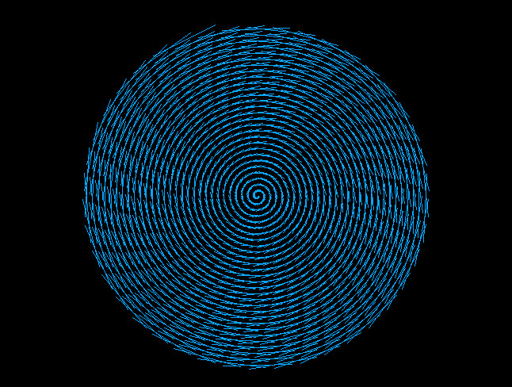

# Algorithmic Visualizer

## What is Algorithmic Visualizer

Algorithmic Visualizer is a visualizer for algorithms developed in Lua, 
Allowing you to render multiple different geometrical patterns and algorithms as you wish using Lua.

## Usage

Algorithmic Visualizer Comes bundled with the following custom lua functions :

- setcolor(R,G,B,ALPHA) Set's the color of the rendering.
- renderline(x1,x2,y1,y2) Draws a line from x1 to x2 and from y1 to y2.
- loadfile() No parameter function for loading lua files.

## Examples

### Sierpinski Triangle

[View the Lua file](Examples/Sierpinski_Triangle.lua)

### Spiral

[View the Lua file](Examples/Spiral.lua)

## Dependencies

Algorithmic Visualizer requires the following dependencies :

- LUA [https://github.com/lua/lua]
- SDL2

# Made by Kernels.
